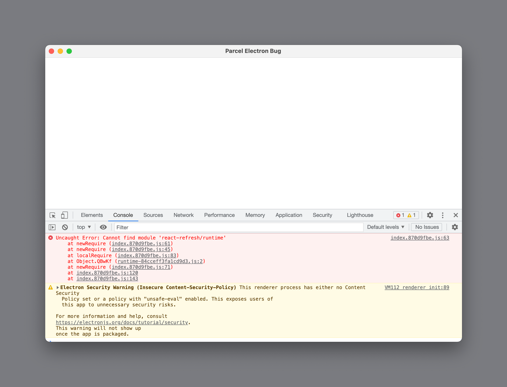

# Parcel Electron Issue

I've setup Parcel 2 to build the renderer of my Electron app. This repo reproduces an issue I'm having.

## The Problem

When launching the Electron app by running `yarn dev` from the root of the Repo, I get this error:

```
Uncaught Error: Cannot find module 'react-refresh/runtime'
    at newRequire (index.870d9fbe.js:61)
    at newRequire (index.870d9fbe.js:45)
    at localRequire (index.870d9fbe.js:83)
    at Object.QBwKf (runtime-84cceff3fa1cd9d3.js:2)
    at newRequire (index.870d9fbe.js:71)
    at index.870d9fbe.js:120
    at index.870d9fbe.js:143
```



## Background – What I've done

-   The renderer that is built with Parcel is inside the `client/` folder
-   I've setup electron-renderer as a target in `client/package.json`:
    ```
    "targets": {
    	"default": {
    		"context": "electron-renderer"
    	}
    },
    ```
-   I'm building for the "default" target in my dev-script (`client/scripts/dev.js`):
    ```
    // ...
    const bundler = new Parcel({
    	entries: 'src/index.html',
    	targets: ['default'],
    	// ...
    ```
-   The Electron app opens a BrowserWindow at `http://localhost:4848` (`electron/src/index.ts`)
